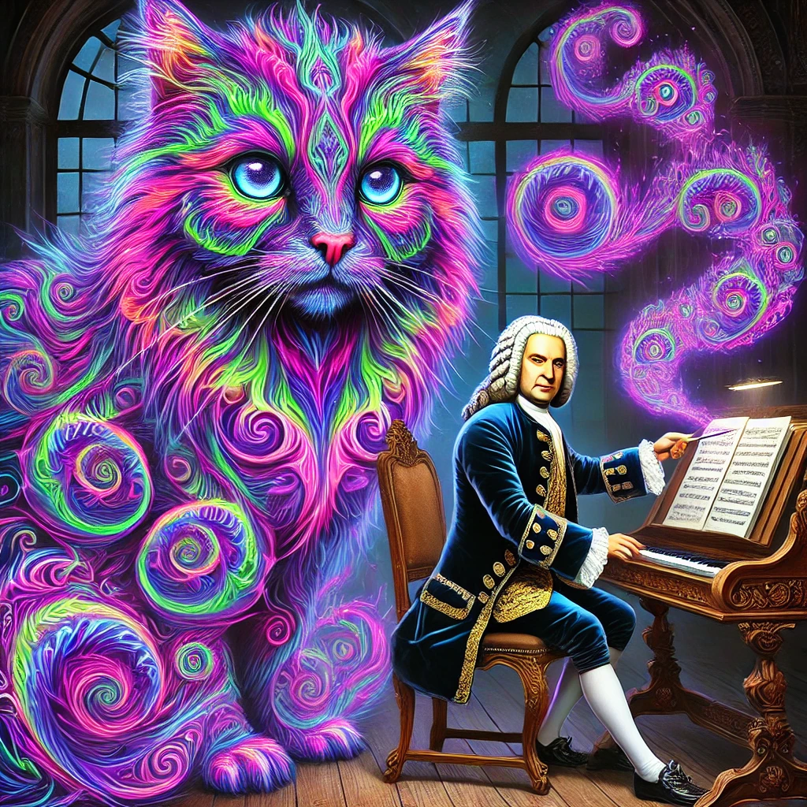
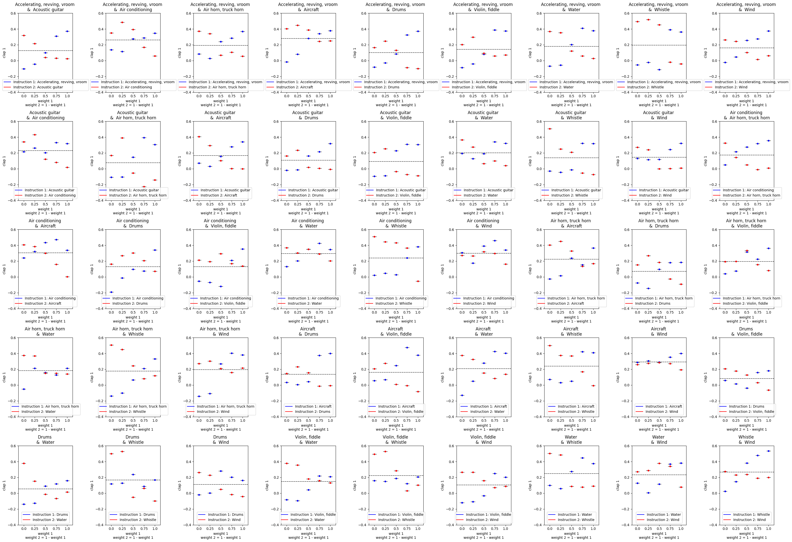

<link href="https://fonts.googleapis.com/css2?family=Tangerine&display=swap" rel="stylesheet">
<link href="https://fonts.googleapis.com/css2?family=Pinyon+Script&display=swap" rel="stylesheet">

  Fugatto 1

 Foundational Generative Audio Transformer Opus 1

  

    
  

  

    <video width="100%" height="auto" controls>
      <source src="fugatto.mov" type="video/mp4">
      Your browser does not support the video tag.
    </video>
  

_Fugatto_ is a framework for audio synthesis and transformation given text instructions and optional audio inputs. The framework includes the Fugatto model itself, the generative model, a dataset creation technique that exploits relationships between audio and text, and a method for controlling and composing instructions, including from different models, called ComposeableART.

We envision _Fugatto_ as a tool for creatives, empowering them to quickly bring their sonic fantasies and unheard sounds to life—an instrument for imagination, not a replacement for creativity.

[Paper](FUGATTO_ICLR_2025.pdf)

## Creative Examples
This section provides a collection of sound pieces that were created by first using Fugatto to create and modify assets, then using a digital audio workstation to combine them.

**1. Rap Song** 
[Singing Voice Synthesis (SVS), Text-To-Speech Synthesis (TTS), Text-To-Audio Synthesis (TTA)]

<table style="width: 100%; table-layout: fixed;">
   <thead>
      <tr>
         <th style="text-align: left; font-style: italic;">Fugatto</th>
         <th style="text-align: left">Audio Context</th>
      </tr>
   </thead>
   <tbody>
      <tr>
         <td style="text-align: left"><audio controls style="width: 150px;"><source src="rap song.mp3" type="audio/wav"></audio></td>
         <td style="text-align: left"><audio controls style="width: 150px;"><source src="rap backing track.mp3" type="audio/wav"></audio></td>
      </tr>       
   </tbody>
</table>

**2. Introduction for a Movie and _Recitativo Accompagnato_** 
[Singing Voice Synthesis (SVS), Text-To-Speech Synthesis (TTS), Text-To-Audio Synthesis (TTA)]

<table style="width: 100%; table-layout: fixed;">
   <thead>
      <tr>
         <th style="text-align: left; font-style: italic;">Fugatto</th>
      </tr>
   </thead>
   <tbody>
      <tr>
         <td style="text-align: left"><audio controls style="width: 150px;"><source src="movie intro.mp3" type="audio/wav"></audio></td>
      </tr>       
   </tbody>
</table>

## Emergent Sounds and Capabilities

[Text-To-Audio Synthesis (TTA)]

This section provides a collection of sound snippets that are unlikely to exist in the real world and in the training data. Assuming the text instructions describe the task, and that _Fugatto_ has not seen such instructions during training, _Fugatto_ is able to execute these tasks without explicit supervision.

<table style="width: 100%; table-layout: fixed;">
   <thead>
      <tr>
         <th style="text-align: left; font-style: italic;">Fugatto</th>
         <th style="text-align: left">Instruction</th>
         <th style="text-align: left">Emergence?</th>         
      </tr>
   </thead>
   <tbody>
      <tr>
         <td style="text-align: left"><audio controls style="width: 150px;"><source src="Electronic Dance Music, Dogs Barking, Cats Meowing.wav" type="audio/wav"></audio></td>
          <td style="text-align: left">Synthesize Electronic Dance Music, Dogs Barking, Cats Meowing.</td>
          <td style="text-align: left">Dogs barking in sync with the music.</td>          
      </tr>   
      <tr>
         <td style="text-align: left"><audio controls style="width: 150px;"><source src="Banjo and rainfall.wav" type="audio/wav"></audio></td>      
         <td style="text-align: left">Synthesize Banjo and Rainfall</td>
         <td style="text-align: left">Unlikely existence of banjo and rain sounds at the same time in the training data.</td>         
      </tr>       
      <tr>
         <td style="text-align: left"><audio controls style="width: 150px;"><source src="Drum kit and ticking clock.wav" type="audio/wav"></audio></td>      
         <td style="text-align: left">Synthesize Drum kit and ticking clock.</td>
         <td style="text-align: left">Clocks tick but not musically nor with the sound of drum sticks.</td>
      </tr>
      <tr>
         <td style="text-align: left"><audio controls style="width: 150px;"><source src="Design factory machinery that screams in metallic agony.wav" type="audio/wav"></audio></td>      
         <td style="text-align: left">Design factory machinery that screams in metallic agony.</td>
         <td style="text-align: left">Factory machinery does not scream in agony.</td>         
      </tr>  
      <tr>
         <td style="text-align: left"><audio controls style="width: 150px;"><source src="Produce a typewriter that whispers each letter typed.wav" type="audio/wav"></audio></td>      
         <td style="text-align: left">Produce a typewriter that whispers each letter typed.</td>
         <td style="text-align: left">Typewriters generally have a strong onset for every letter typed.</td>         
      </tr>          
      <tr>
         <td style="text-align: left"><audio controls style="width: 150px;"><source src="Produce a soundscape with a choir of sirens to produce a lush and calm choir composition with sustained chords.wav" type="audio/wav"></audio></td>      
         <td style="text-align: left">Produce a soundscape with a choir of sirens to produce a lush and calm choir composition with sustained chords.</td>
         <td style="text-align: left">Music instruments, not sirens, create choirs and lush chords.</td>         
      </tr>
      <tr>
         <td style="text-align: left"><audio controls style="width: 150px;"><source src="Produce an oral delivery of a male dog barking in English saying the words.wav" type="audio/wav"></audio></td>      
         <td style="text-align: left">Produce an oral delivery of a male dog barking in English saying the words "I need to know… who let the dogs out?", with the sound of a male dog barking.</td>
         <td style="text-align: left">Dogs don't speak and people, normally, do not bark.</td>         
      </tr>
      <tr>
         <td style="text-align: left"><audio controls style="width: 150px;"><source src="Produce an oral delivery of a violin playing a beautiful solo in English saying the words.wav" type="audio/wav"></audio></td>      
         <td style="text-align: left">Produce an oral delivery of a violin playing a beautiful solo in English saying the words "I need to know; Who let the dogs out?", sounding like a violin playing a beautiful solo.</td>
         <td style="text-align: left">People normally don't slide between notes, like a violin, when they speak.</td>         
      </tr>
      <tr>
         <td style="text-align: left"><audio controls style="width: 150px;"><source src="Synthesize a cello shouting with anger and a cello screaming.wav" type="audio/wav"></audio></td>      
         <td style="text-align: left">Synthesize a cello shouting with anger and a cello screaming.</td>
         <td style="text-align: left">Aside from Xenakis' music, cellos do not shout in anger nor scream.</td>         
      </tr>
      <tr>
         <td style="text-align: left"><audio controls style="width: 150px;"><source src="Synthesize a female voice barking and a female voice meowing.wav" type="audio/wav"></audio></td>    
          <td style="text-align: left">Synthesize a female voice barking.</td>
         <td style="text-align: left">People, normally, do not bark</td>          
      </tr>     
      <tr>
         <td style="text-align: left"><audio controls style="width: 150px;"><source src="Synthesize a flute barking and a flute meowing.wav" type="audio/wav"></audio></td>      
         <td style="text-align: left">Synthesize a flute barking and a flute meowing.</td>
         <td style="text-align: left">Flutes do not bark nor meow.</td>         
      </tr>     
      <tr>
         <td style="text-align: left"><audio controls style="width: 150px;"><source src="Synthesize a saxophone barking and a saxophone meowing (1).wav" type="audio/wav"></audio></td>
         <td style="text-align: left">Synthesize a saxophone barking and a saxophone meowing.</td>
         <td style="text-align: left">Aside from Free Jazz, Saxophones do not bark nor meow.</td>         
      </tr>
      <tr>
         <td style="text-align: left"><audio controls style="width: 150px;"><source src="Synthesize a saxophone barking and a saxophone meowing (0).wav" type="audio/wav"></audio></td>
         <td style="text-align: left">Synthesize a saxophone barking and a saxophone meowing.</td>
         <td style="text-align: left">Aside from "Interstellar Spaces", Saxophones do not bark nor meow.</td>         
      </tr>      
     <tr>
         <td style="text-align: left"><audio controls style="width: 150px;"><source src="Violin melody and baby laugh.wav" type="audio/wav"></audio></td>     
         <td style="text-align: left">Violin melody and baby laugh</td>
         <td style="text-align: left">Violins do not laugh like babies, nor do babies sound like violins.</td>         
      </tr>  
   </tbody>
</table>

[MIDI-2-Audio (Audio-Transformation)]

This section provides a collection of examples to showcase Fugatto's ability to convert from MIDI audio to natural Audio. We emphasize that this is zero-shot behavior and emergent capability, given that Fugatto has never seen monophonic melodies during MIDI2Audio training, with the average number of stems present in training this task being 8.
<table>
   <tbody>
      <tr>
         <td style="text-align: left; font-style: italic;">Fugatto</td>
         <td style="text-align: left"><audio controls style="width: 150px;"><source src="54334_Csharp_4_minor_9_7_down_down_down_up_0.wav" type="audio/wav"></audio></td>         
         <td style="text-align: left"><audio controls style="width: 150px;"><source src="3207_C_4_major_7_4_up_down_down_down_0.wav" type="audio/wav"></audio></td>
         <td style="text-align: left"><audio controls style="width: 150px;"><source src="14514_C_4_minor_4_11_up_up_down_up_0.wav" type="audio/wav"></audio></td>           
         <td style="text-align: left"><audio controls style="width: 150px;"><source src="26540_C_4_blues_3_6_down_down_up_up_0.wav" type="audio/wav"></audio></td>    
      </tr>        
      <tr>
         <td style="text-align: left">Audio Context</td>
         <td style="text-align: left"><audio controls style="width: 150px;"><source src="54334_transposed.wav" type="audio/wav"></audio></td>
         <td style="text-align: left"><audio controls style="width: 150px;"><source src="3207_transposed.wav" type="audio/wav"></audio></td>
         <td style="text-align: left"><audio controls style="width: 150px;"><source src="14514_transposed.wav" type="audio/wav"></audio></td>
         <td style="text-align: left"><audio controls style="width: 150px;"><source src="26540_transposed.wav" type="audio/wav"></audio></td>
      </tr>
   </tbody>   
</table> 

[ComposableART and Text-To-Audio(TTA)]

This sections provides a collection of emergent sounds achieved with our proposed ComposeableART method, that enables the interpolation, in the latent space, between instructions.
<table style="width: 100%; table-layout: fixed;">
   <thead>
      <tr>
         <th style="text-align: left; font-style: italic;">Weights/Events</th>
         <td style="text-align: left">Cymbals and Flute</td>
         <td style="text-align: left">Accelerating, revving, vroom and Acoustic Guitar</td>
         <td style="text-align: left">Speech and Water</td>
         <td style="text-align: left">Acoustic Guitar and Water</td>
      </tr>         
   </thead>
   <tbody>
      <tr>
         <td style="text-align: left">w1=1.0 w2=0.0</td>
         <td style="text-align: left"><audio controls style="width: 100px;"><source src="Cymbals and Flute w1-1p0w2-0p0.wav" type="audio/wav"></audio></td>
         <td style="text-align: left"><audio controls style="width: 100px;"><source src="Accelerating, revving, vroom and Acoustic Guitar w1-1p0w2-0p0.wav" type="audio/wav"></audio></td>
         <td style="text-align: left"><audio controls style="width: 100px;"><source src="speech and water w1-1p0w2-0p0.wav" type="audio/wav"></audio></td>
         <td style="text-align: left"><audio controls style="width: 100px;"><source src="acoustic guitar and water w1-1p0w2-0p0.wav" type="audio/wav"></audio></td>      
      </tr>
      <tr>
         <td style="text-align: left">w1=0.75 w2=0.25</td>
         <td style="text-align: left"><audio controls style="width: 100px;"><source src="Cymbals and Flute w1-0p75w2-0p25.wav" type="audio/wav"></audio></td>
         <td style="text-align: left"><audio controls style="width: 100px;"><source src="Accelerating, revving, vroom and Acoustic Guitar w1-0p75w2-0p25.wav" type="audio/wav"></audio></td>
         <td style="text-align: left"><audio controls style="width: 100px;"><source src="speech and water w1-0p75w2-0p25.wav" type="audio/wav"></audio></td>
         <td style="text-align: left"><audio controls style="width: 100px;"><source src="acoustic guitar and water w1-0p75w2-0p25.wav" type="audio/wav"></audio></td>   
      </tr>
      <tr>
         <td style="text-align: left">w1=0.5 w2=0.5</td>         
         <td style="text-align: left"><audio controls style="width: 100px;"><source src="Cymbals and Flute w1-0p5w2-0p5.wav" type="audio/wav"></audio></td>
         <td style="text-align: left"><audio controls style="width: 100px;"><source src="Accelerating, revving, vroom and Acoustic Guitar w1-0p5w2-0p5.wav" type="audio/wav"></audio></td>            
         <td style="text-align: left"><audio controls style="width: 100px;"><source src="speech and water w1-0p5w2-0p5.wav" type="audio/wav"></audio></td>
         <td style="text-align: left"><audio controls style="width: 100px;"><source src="acoustic guitar and water w1-0p5w2-0p5.wav" type="audio/wav"></audio></td>   
      </tr>
      <tr>
         <td style="text-align: left">w1=0.25 w2=0.75</td>         
         <td style="text-align: left"><audio controls style="width: 100px;"><source src="Cymbals and Flute w1-0p25w2-0p75.wav" type="audio/wav"></audio></td>
         <td style="text-align: left"><audio controls style="width: 100px;"><source src="Accelerating, revving, vroom and Acoustic Guitar w1-0p25w2-0p75.wav" type="audio/wav"></audio></td>            
         <td style="text-align: left"><audio controls style="width: 100px;"><source src="speech and water w1-0p25w2-0p75.wav" type="audio/wav"></audio></td>
         <td style="text-align: left"><audio controls style="width: 100px;"><source src="acoustic guitar and water w1-0p25w2-0p75.wav" type="audio/wav"></audio></td>   
      </tr>
      <tr>
         <td style="text-align: left">w1=0.0 w2=1.0</td>
         <td style="text-align: left"><audio controls style="width: 100px;"><source src="Cymbals and Flute w1-0p0w2-1p0.wav" type="audio/wav"></audio></td>         
         <td style="text-align: left"><audio controls style="width: 100px;"><source src="Accelerating, revving, vroom and Acoustic Guitar w1-0p0w2-1p0.wav" type="audio/wav"></audio></td>         
         <td style="text-align: left"><audio controls style="width: 100px;"><source src="speech and water w1-0p0w2-1p0.wav" type="audio/wav"></audio></td>
         <td style="text-align: left"><audio controls style="width: 100px;"><source src="acoustic guitar and water w1-0p0w2-1p0.wav" type="audio/wav"></audio></td>        
      </tr>
      <tr>
         <td style="text-align: left">Emergence from combination?</td>
         <td style="text-align: left">From cymbals to gamelan to flute.</td>
         <td style="text-align: left">From revving to electric guitar with distortion to acoustic guitar.</td>
         <td style="text-align: left">From speech to underwater speech to water.</td>
         <td style="text-align: left">From acoustic guitar to underwater acoustic guitar to water.</td>
      </tr>      
   </tbody>
</table>

## ComposableART (Composable Audio Representation Transformations)
ComposableART is a technique for compositonal synthesis where we extend the Classifier Free Guidance framework to support the combination of vector fields across
multiple instructions, multiple mel-frame indices and multiple models.

This section provides a collection of sound pieces that were created by applying ComposableART to Fugatto model and each of them highlights one of special features brought by ComposableART:

**1. Weighted Combination** 
[Text-To-Audio Synthesis (TTA)]

<table style="width: 100%; table-layout: fixed;">
   <thead>
      <tr>
         <th style="text-align: left; font-style: italic;">Weighted Combination Equal Weights on Birds and Dogs</th>
         <th style="text-align: left; font-style: italic;">Weighted Combination Birds Emphasized</th>
         <th style="text-align: left; font-style: italic;">Weighted Combination Dogs Emphasized</th>
      </tr>
   </thead>
   <tbody>
      <tr>
         <td style="text-align: left"><audio controls style="width: 150px;"><source src="WeightedCombination_composed_equal_birds0p2_dogs0p2.wav" type="audio/wav"></audio></td>
         <td style="text-align: left"><audio controls style="width: 150px;"><source src="WeightedCombination_composed_equal_birds2p0_dogs0p2.wav" type="audio/wav"></audio></td>
         <td style="text-align: left"><audio controls style="width: 150px;"><source src="WeightedCombination_composed_equal_birds0p2_dogs2p0.wav" type="audio/wav"></audio></td>
      </tr>       
   </tbody>
</table>

**Plots with CLAP Scores for the Weighted Combination of events with ComposableART** 

Each plot shows the CLAP score for each instruction, or event, given the weight of that instruction.

  

 

**2. Negation** 
[Text-To-Speech (TTS)]

<table style="width: 100%; table-layout: fixed;">
   <thead>
      <tr>
         <th style="text-align: left; font-style: italic;">Negation of 'male' with Fugatto Baseline using 'Not'</th>
         <th style="text-align: left; font-style: italic;">Positive weight on 'male' with ComposableART</th>
         <th style="text-align: left; font-style: italic;">Negative weight on 'male' with ComposableART</th>
      </tr>
   </thead>
   <tbody>
      <tr>
         <td style="text-align: left"><audio controls style="width: 150px;"><source src="Negation_Baseline_Non_Male_Voice.wav" type="audio/wav"></audio></td>
         <td style="text-align: left"><audio controls style="width: 150px;"><source src="Negation_ComposableART_male_0p2.wav" type="audio/wav"></audio></td>
         <td style="text-align: left"><audio controls style="width: 150px;"><source src="Negation_ComposableART_Negative.wav" type="audio/wav"></audio></td>
      </tr>       
   </tbody>
</table>

**3. Task Composition** 
[Text-To-Audio Synthesis (TTA), Text-To-Speech (TTS)]

<table style="width: 100%; table-layout: fixed;">
   <thead>
      <tr>
         <th style="text-align: left; font-style: italic;">Task Composition with audio event 'birds chirping' and music synthesis</th>
         <th style="text-align: left; font-style: italic;">Task Composition with audio event 'dogs barking', 'birds chirping' and music synthesis</th>
         <th style="text-align: left; font-style: italic;">Task Composition with audio event 'birds chirping' and text to speech(TTS)</th>
      </tr>
   </thead>
   <tbody>
      <tr>
         <td style="text-align: left"><audio controls style="width: 150px;"><source src="TaskComposition_audio_event_birds_with_music.wav" type="audio/wav"></audio></td>
         <td style="text-align: left"><audio controls style="width: 150px;"><source src="TaskComposition_audio_events_birds_with_dogs_with_music.wav" type="audio/wav"></audio></td>
         <td style="text-align: left"><audio controls style="width: 150px;"><source src="TaskComposition_audio_events_birds_with_TTS.wav" type="audio/wav"></audio></td>
      </tr>       
   </tbody>
</table>

**4. Model Composition with 2 different Fugatto models, one trained on Text-To-Audio Synthesis (TTA) and other on Text-To-Speech (TTS)** 
[Text-To-Audio Synthesis (TTA), Text-To-Speech (TTS)]

<table style="width: 100%; table-layout: fixed;">
   <thead>
      <tr>
         <th style="text-align: left; font-style: italic;">Model Composition with audio event 'birds chirping' and ambient text to speech in background</th>
         <th style="text-align: left; font-style: italic;">Model Composition with audio event 'dogs barking' and text to speech</th>
         <th style="text-align: left; font-style: italic;">Model Composition with audio event 'water flowing' and text to speech</th>
      </tr>
   </thead>
   <tbody>
      <tr>
         <td style="text-align: left"><audio controls style="width: 150px;"><source src="ModelComposition_birds_chirping_with_ambient_background_speech.wav" type="audio/wav"></audio></td>
         <td style="text-align: left"><audio controls style="width: 150px;"><source src="ModelComposition_dogs_barking_with_TTS.wav" type="audio/wav"></audio></td>
         <td style="text-align: left"><audio controls style="width: 150px;"><source src="ModelComposition_water_flowing_with_TTS.wav" type="audio/wav"></audio></td>
      </tr>       
   </tbody>
</table>

**5. Temporal Composition** 
[Text-To-Audio Synthesis (TTA), Text-To-Speech (TTS)]

<table style="width: 100%; table-layout: fixed;">
   <thead>
      <tr>
         <th style="text-align: left; font-style: italic;">Temporal Composition simulating a 'rainy' night turining to a 'chirpy' dawn.</th>
         <th style="text-align: left; font-style: italic;">Temporal Composition simulating 'Ukelele' melody turining to brass metalic 'Engine' tragedy.</th>
         <th style="text-align: left; font-style: italic;">Temporal Composition simulating a 'thunderous' stormy fading into a 'rainy' storm.</th>
      </tr>
   </thead>
   <tbody>
      <tr>
         <td style="text-align: left"><audio controls style="width: 150px;"><source src="Temporal_Compositionality_synthesize_birds_chirping_synthesize_Rain_0.wav" type="audio/wav"></audio></td>
         <td style="text-align: left"><audio controls style="width: 150px;"><source src="Temporal_Compositionality_synthesize_Engine_synthesize_Ukulele_0.wav" type="audio/wav"></audio></td>
         <td style="text-align: left"><audio controls style="width: 150px;"><source src="Temporal_Compositionality_synthesize_Storm_synthesize_Thunder_0.wav" type="audio/wav"></audio></td>
      </tr>       
   </tbody>
</table>
